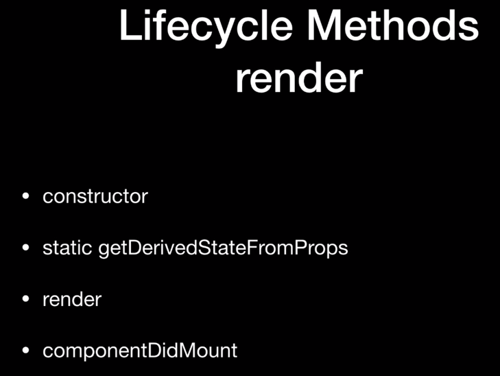
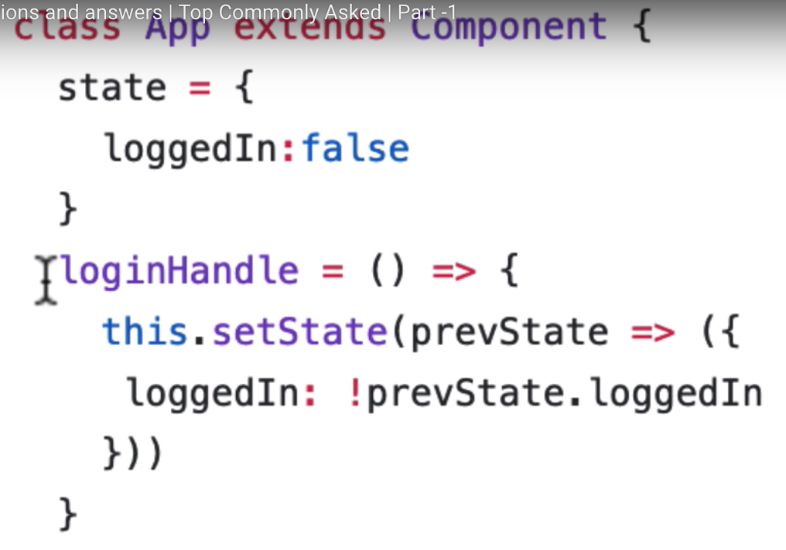
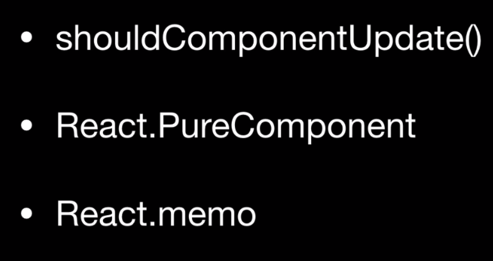

# Common React Interview Questions

## Lifecycle Methods

- **Name Lifecycle Methods and Their Purpose**

_If using react hooks, they use a completely different method of handling lifecycle methods._

- Their are two phases of rendering initial rendering and re-rendering and they have different lifecycle methods.

### Constructor

- First hook happens in the constructor. It runs only once during the initial phase.
  The job of the **constructor** is to set the **initial state**. It is the only place that we can set the initial state using `this.state = {};`. After this, we have to use `this.setState` if you want to change the state.

### `static getDerivedStateFromProps` (update from old method `componentWillReceiveProps`)

- runs right after the constructor
- plays a role in the initial render and the re-render phase
- It tries to get the derived state from the change in props.
- **Why would you have a static method?**
  - because you don't want the user to have direct access to `this`
  - static methods are class methods and not instance methods
  - you can not directly set state using `this.setState`
- ## **How does it change state?**
  - it returns newState or null
- this method is rarely used

### Render

- This is where you return your **JSX**
- the only method that is mandatory
- -You cannot `setState` here because it will cause an infinite loop.

### ComponentDidMount

- Runs after the component is actually mounted
- Common with using third party components to notify that the DOM is ready for that component to be used. The DOM must be ready before that component uses it.

### Re-Render

- Where something changes in your state or props and the React component needs to re-render itself. This could happen any time there is a change.
- Means lifecycle can run many times.

### `shouldComponentUpdate`

- only runs during re-render.
- makes decision if component really needs to be updated.
- example is if you use `setState` multiple times with the same outcome, no need for re-render. You can make this decision inside of this lifecycle hook.

### `getSnapshotBeforeUpdate`

- Used in pre-commit phase
- replacement for **`componentWillUpdate`**
- reason for using is React has recently introduced **lazy loading** or **async rendering**

### `componentDidUpdate`

- validates completion of rendering
- similar to **`componentDidMount`**

### `componentWillUnmount`

- not part of rendering or re-rendering. Used when component dies is unmounted.

## What are the advantages of using arrow functions in React

- in this example this is bound to the class object instead because of arrow functions.
- Traditionally if you have a function inside of a function and are using the `this` keyword with arrow functions, the `this` keyword belongs to the function it came from not the class or outside object.
- **arrow functions** do not automatically have their own `this`. It automatically takes its `this` from its **lexical scope**.
- You can also bind to the class using the constructor function but it is easier this way in the example.
- In React you can have `onClick` handlers.

## How to prevent components from re-rendering

### `ShouldComponentUpdate()`

- A lifecycle method that is part of the re-render cycle.
- It checks if it should render or not
- you can compare current state with previous state and decide if it needs to re-render.
- If it returns false, the rendering is stopped.

### `ReactPureComponent`

- Shallow compares the previous state and the current state. If they're the same, it stops rendering.
- instead of using `extends React.Component` you use `extends React.PureComponent.
- Only works for class components not for functional or presentational components.

### `React.memo`

- If you're using a presentational or functional component, you can use `React.memo`
- Uses memoization which prevents having to calculate the whole thing each time
