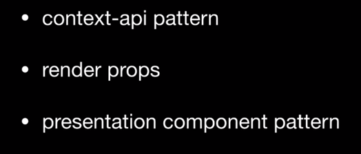
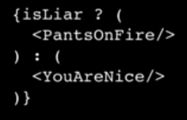

# Common React Interview Questions

## Lifecycle Methods

- **Name Lifecycle Methods and Their Purpose**

react

_If using react hooks, they use a completely different method of handling lifecycle methods._

- There are two phases of rendering initial rendering and re-rendering and they have different lifecycle methods.

### Constructor

- First hook happens in the constructor. It runs only once during the initial phase.
  The job of the **constructor** is to set the **initial state**. It is the only place that we can set the initial state using `this.state = {};`. After this, we have to use `this.setState` if you want to change the state.

### `static getDerivedStateFromProps` (update from old method `componentWillReceiveProps`)

- runs right after the constructor
- plays a role in the initial render and the re-render phase
- It tries to get the derived state from the change in props.
- **Why would you have a static method?**
  - because you don't want the user to have direct access to `this`
  - static methods are class methods and not instance methods
  - you can not directly set state using `this.setState`

**How does it change state ?**

- it returns newState or null
- this method is rarely used

### Render

- This is where you return your **JSX**
- the only method that is mandatory
- -You cannot `setState` here because it will cause an infinite loop.

### ComponentDidMount

- Runs after the component is actually mounted
- Common with using third party components to notify that the DOM is ready for that component to be used. The DOM must be ready before that component uses it.

### Re-Render

- Where something changes in your state or props and the React component needs to re-render itself. This could happen any time there is a change.
- Means lifecycle can run many times.

### `shouldComponentUpdate`

- only runs during re-render.
- makes decision if component really needs to be updated.
- example is if you use `setState` multiple times with the same outcome, no need for re-render. You can make this decision inside of this lifecycle hook.

### `getSnapshotBeforeUpdate`

- Used in pre-commit phase
- replacement for **`componentWillUpdate`**
- reason for using is React has recently introduced **lazy loading** or **async rendering**

### `componentDidUpdate`

- validates completion of rendering
- similar to **`componentDidMount`**

### `componentWillUnmount`

- not part of rendering or re-rendering. Used when component dies is unmounted.

## What are the advantages of using arrow functions in React

- in this example this is bound to the class object instead because of arrow functions.
- Traditionally if you have a function inside of a function and are using the `this` keyword with arrow functions, the `this` keyword belongs to the function it came from not the class or outside object.
- **arrow functions** do not automatically have their own `this`. It automatically takes its `this` from its **lexical scope**.
- You can also bind to the class using the constructor function but it is easier this way in the example.
- In React you can have `onClick` handlers.

## How to prevent components from re-rendering

### `ShouldComponentUpdate()`

- A lifecycle method that is part of the re-render cycle.
- It checks if it should render or not
- you can compare current state with previous state and decide if it needs to re-render.
- If it returns false, the rendering is stopped.

### `ReactPureComponent`

- Shallow compares the previous state and the current state. If they're the same, it stops rendering.
- instead of using `extends React.Component` you use `extends React.PureComponent.
- Only works for class components not for functional or presentational components.

### `React.memo`

- If you're using a presentational or functional component, you can use `React.memo`
- Uses memoization which prevents having to calculate the whole thing each time

## Explain error boundaries (lifecycle methods)

- create a component and wrap it around your component.
- `static getDerivedStateFromError` derives `state` from the error. When the error happens, you catch the error and change the state accordingly.
  - Can use a fallback component which will render itself in case of an error. Ex. error message...
- `componentDidCatch` can log error that is happening.

## Best lifecycle methods for making API calls

### `componentDidMount`

- when you make an API request, you get data returned from a server and most likely the state is updated. This results in re-rendering of the component.
- When you make the API call, you want to make sure to use `componentDidMount` to make sure the `DOM` is ready.

## React Patterns

### Context API

- makes it easier to pass `props` into a deeply nested component.
- allows you to access `props` by using a special tag to wrap everything.
  - `Provider Component` is higher in the tree that accepts `props`
  - `Consumer Component` is used anywhere you want to use `props`

## Render Props

- Primarily uses children as functions
- instead of passing a component as a component you pass in a function as a component and render it.

## Presentational Component Pattern

- written as stateless functional components.

## Why would you use React in your project

- Look for stability in frameworks before using
- React is functional programming that allows you to use a lot of JavaScript.
- If you have a lot of JavaScript engineers, it might be a better fit than Angular which uses its own syntax.

## What is the css-in-js pattern in JavaScript

- you can pass css as javascript literal objects to create inline css so it doesn't pollute pollute other parts.
- Another advantage is if you have a prop, you can conditionally render.
- You can import css styles to javascript objects (share common styles across projects)

## Why can't you update `state` directly without `setState()`

- `setState()` will always trigger a re-rendering of the component. You do want to re-render when the `state` has changed so your **View** is updated.
  - When you use `setState()` you are actually making a copy of the `state` and then modifying and passing it to `setState()`. You can't achieve this properly when setting `state` directly. You are also not allowed to use update `state` directly without errors.

## How many ways can you conditionally render in React

## What are Fragments and why do we use them in React

- Whenever you render a component, you can only render a single child (the above is not allowed in React)

- React found a way around this using `React.Fragment`

## How do you do code splitting in React

- When the React code compiles to the bundler, a single bundle is created of the entire application into one file.
- React came up with a way to split code into multiple bundles in case someone was using only a few pages of a site instead of the whole thing.

- React introduced **Dynamic Import** or **Lazy Loading** for importing individual components.

- Loads asynchronously.
- Renders fallback component.

## What are some of the advantages of Redux

