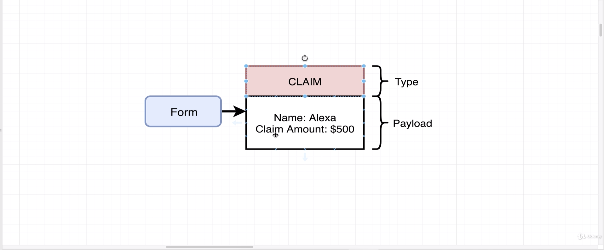
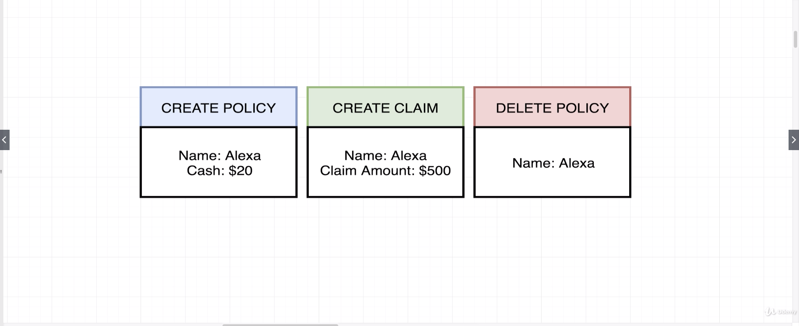
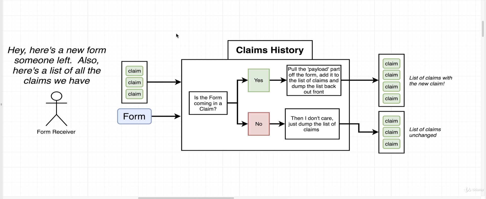
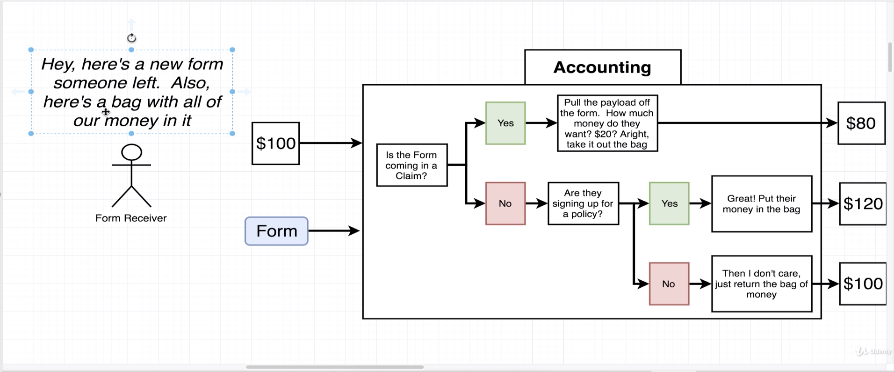
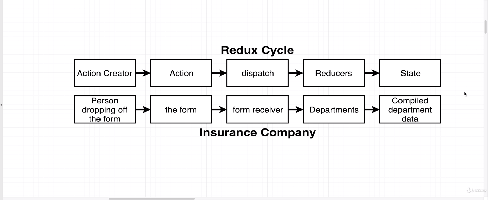

# Redux

- With Redux, rather than authoring state or maintaining state inside of our React components we're going to instead extract it to this redux library

- The React library itself is all about rendering content on the screen and handling user interaction

## Analogy for understanding Redux

- We're going to say that rather than the policies Department internally having a big binder or a big sheet of paper that lists all these customers they're going to instead store that list of policies inside of a central repository of company data that is stored outside of their department.

- A customer is going to fill out a form handed off to the former receiver. The pharmacy will make a copy of it and then hand it off to each department along with that department's little slice of data.

- The idea here is that we want to have all of our data be centralized inside of this outside data store and only
  when a department is given a form are they going to be given their little data set right here and then.

- Everything inside of our insurance company started off with some one some customer dropping a form off that form contains some amount of information that described how they wanted to change some data within our company.
- The form itself had a type and a payload.
- An **Action Creator** in Redux is a function that is going to create or return a plain javascript object.
- We refer to this plain javascript object as an **Action**
- An **Action** has a type property and a payload property. That type property on an **Action** describes some change that we want to make inside of our data.
- The **Payload** property describes some contexts around the change that we want to make the form.
- The purpose of an **Action** is to describe some change that we want to make to the data inside of our application.
- The **Dispatch** function is going to take in an **Action**. It's going to make copies of that object and then pass it off to a bunch of different places inside
  of our application.
- In Redux, a **Reducer** is a function that is responsible
  for taking in an action and some existing amount of data. It's going to process that action and then make some change to the data and then return it so that it can then be centralized in some other location.
- The **State** property is a central repository of all information that has been created by our **Reducers** or by our department.
- All the information gets consolidated inside the **State** object so that our React application can very
  easily reach in to our **Redux** application, the **Redux** side of the app, and get access to all of the data of our application.
- In that way our React app doesn't have to go around to each separate reducer or member of each separate department and ask for the current list of policies or the current state.
