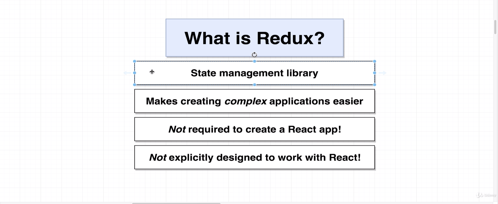
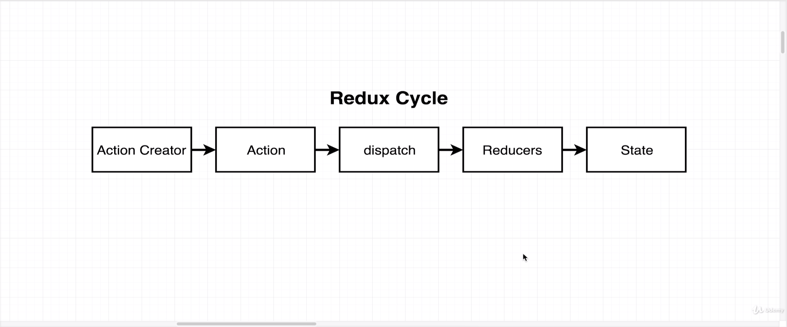
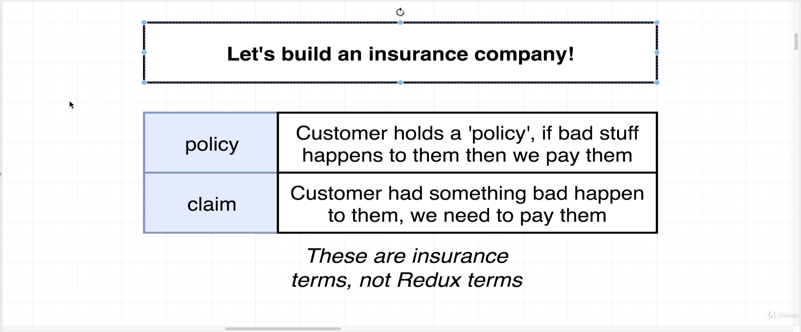
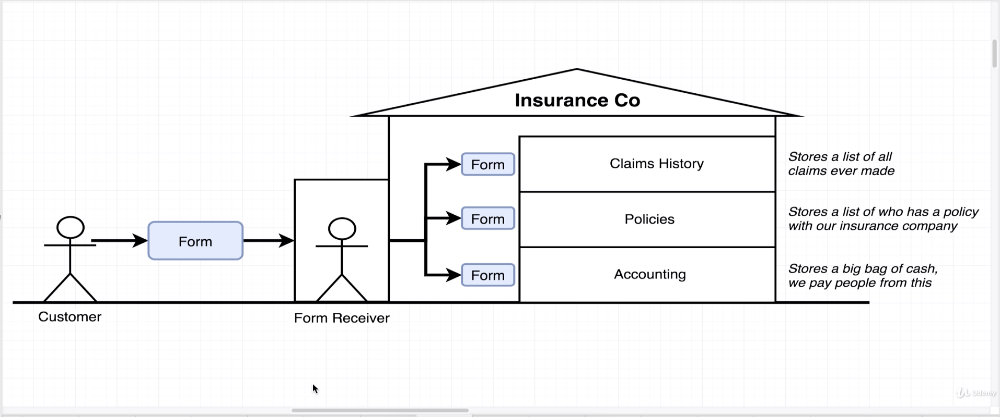
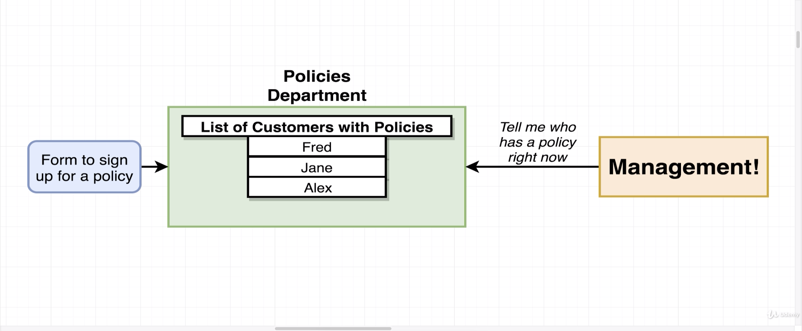
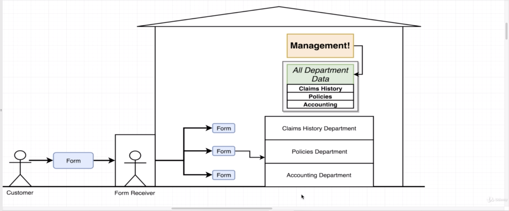

# Redux

- With Redux, rather than authoring state or maintaining state inside of our React components we're going to instead extract it to this redux library

- The React library itself is all about rendering content on the screen and handling user interaction

## Analogy for understanding Redux

- We're going to say that rather than the policies Department internally having a big binder or a big sheet of paper that lists all these customers they're going to instead store that list of policies inside of a central repository of company data that is stored outside of their department.

- A customer is going to fill out a form handed off to the former receiver. The pharmacy will make a copy of it and then hand it off to each department along with that department's little slice of data.

