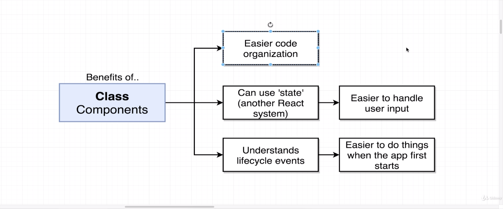
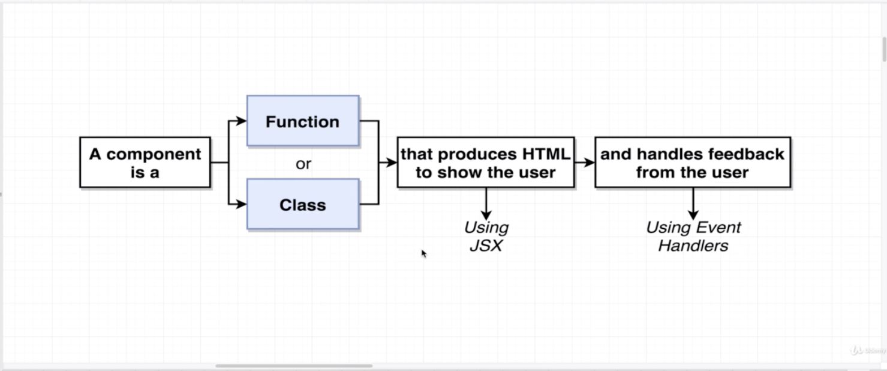
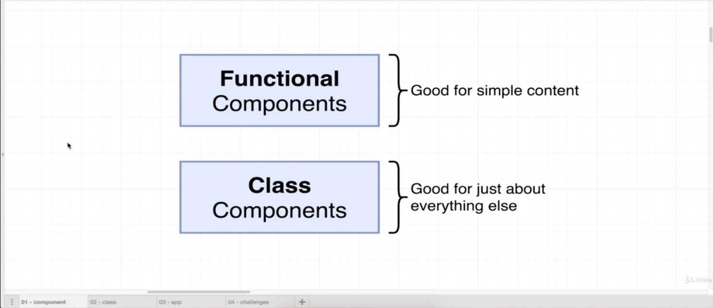
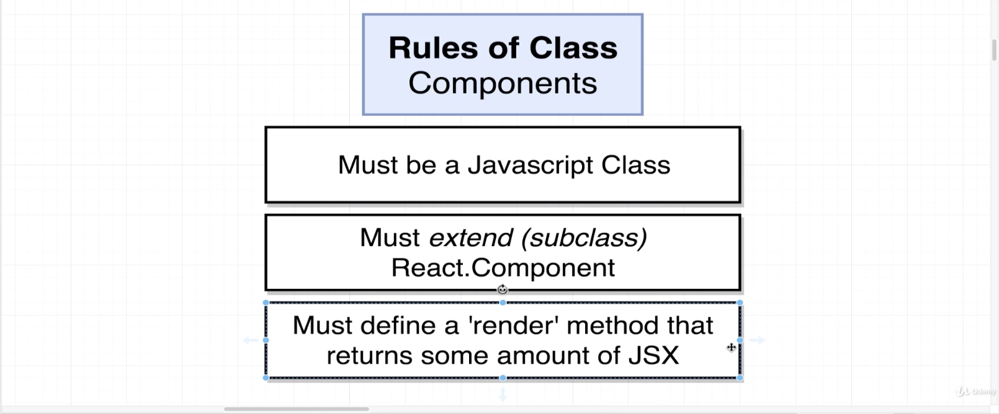

# Class Based Components

* Easier time organizing our code in general.
* They can use the state system in react.
* It's easier to handle user input and update our application in how it looks class based components.
* Also had the benefit of understanding life cycle events.  A life cycle event just means that it's easier to do some tasks when our application first starts up than if we were using a functional component.




## Class based vs Functional Components

* We want to use functional components any time that we are trying to show simple content to the user without a lot of logic behind it.
* If you have any complex logic if you have anything that needs to respond to user input if you have anything that needs to make network requests anything in that regard chances are you're going to want to make a class based component instead.


* The reason that we are extending **React.Component** is that it allows us to pull a
ton of built in functionality from this other class called **React.Component** into our class.
In other words that we are sub-classing React Component.
We're just borrowing functionality into our app class.
* React says we have to define `render()` in a **class** based component or it will not work.

```javascript
import React from 'react'

export default class App extends React.Component {
  render() {
    return (
      <div>

      </div>
    )
  }
}
```

