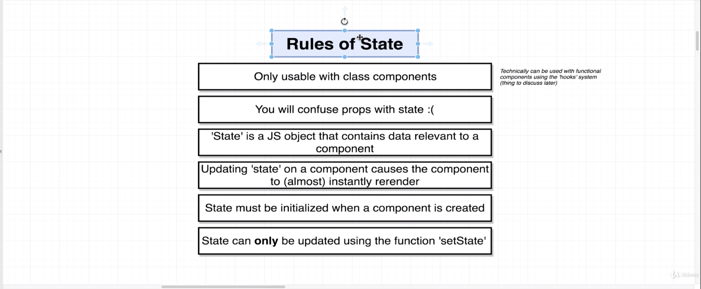
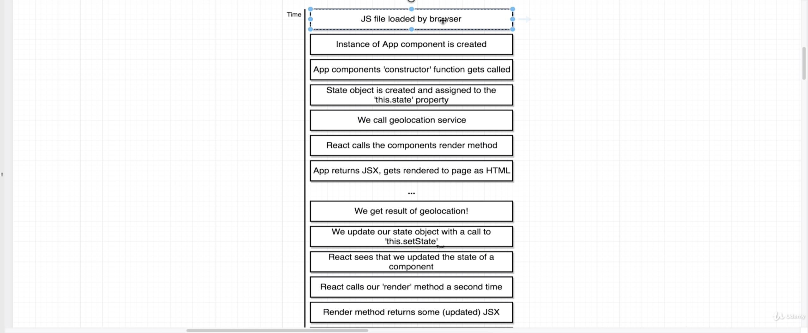

# State

- Can only be used with **class** based components except for using **functional** components with **hooks** system.
- **Props** and **state** are very different but can be confused for one another.
- **State** is a javascript object that contains some amount of data that is relevant to a singular component.
- In our case we would have one piece of **state** or one **state** property that is relevant to our app component and that one single piece of **state** that one single property that we care about in our app component.
- Updating **state** or updating properties inside this javascript object on a component
  will cause our component to almost instantly re-render and that's going to solve issues like time lapses for loading.
- The key to getting a component to the render is to update its **state**.
- The key to getting a component to **render** is to update its **State**.
- If we want to get a single component to update itself. We will update it **state**.
- **State** must be initialized when a component is first created.
- When we first create the component we have to initialize our **state**. That essentially means that when we create a component or an instance of a class we have to initialize the **state** property.
- A **state** property or that **state** object can only be updated using the function **`setState()`**.

## Constructor()

- In a **JavaScript** **class** the **constructor** function is the very first function that is
  going to be called any time an instance of this **class** is created. So in other words any time that we create a new instance of the app component and show it on the screen, this **constructor** function is going to be automatically and instantly called before anything else and so that makes it a very good location for us to initialize our state when our component is first created. (This is not the only way to initialize state).

## Super()

- We still want to make sure that all the set up code inside of a constructor function
  still gets called. So to make sure that the parents or React component's **constructor** function gets called we call **`super()`** with **props**.

- **Super** is a reference to the parent's **constructor** function.

## Render()

- We never want to start to initialize some work or some request or anything like that from a call in the render method. The reason for that is that the rendered method is going to be getting called very frequently.

- Rather than leaving this **`getCurrentPosition()`** call inside of here I'm going to cut it and move it

up to my state or to my constructor and I can put it right underneath the **state** call.

## setState()

- We can update our **state** object using **`setState()`** inside of a function. You can call **`this.setState()`** to pass an object that has the update to **state** that you want to make.
- We never use **Ex**. **`this.state.lat = position.coords.latitude`** to set the state. The only time we do direct assignment for state is when we initialize it below the constructor function.
- Any other time that we want to change update or otherwise manipulate our state property, we are always going to call **`setState()`** as opposed to doing direct assignment like this right here.

