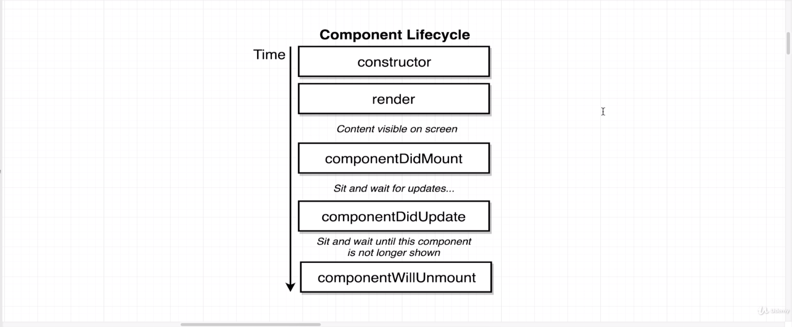
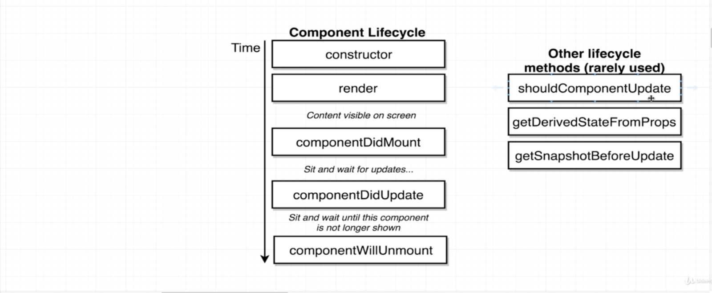

# Life Cycle Methods

- a **component life cycle** method is a function that we can optionally define inside of our class based components if we decide to implement these methods.
- They will be called automatically by react at certain points during a component's life cycle.
- A **life cycle** refers to the fact that a component is going to be created and then show up in the DOM or show up on the screen of our browser. Then at some point in time we might do something like call set state which will cause the component to re-render and then in theory at some point in time a component might be removed from the DOM altogether and stop showing its content on the screen. That entire series of events is referred to as the component's life cycle.

## `Constructor()`

- **`Constructor()` function** is a function that we can optionally define. If we do, it will be automatically called when a new instance of our component is created.
- We can also do some initial data loading inside of a constructor.

## Render Method

- The **`render()` method** is not optional which is unlike all the other methods on here.
- The **`render()` method** is the one function that we absolutely have to define.
- The **`render()` method** is a life cycle function that gets called at some point during the life cycle of a component.
- Here's what happens: We start off with the **`constructor()`** being called then when the **`render()` method** will be called we return some amount of JSX and that content then becomes visible on the screen. After that we're going to see a series of different life cycle methods being called at different points in time.
- In a general, we're going to return some **JSX** that's the only thing we do inside there. We're not going to ever make a network request.

## **`componentDidMount()`**

- First off, immediately after a component shows up on the screen of our browser's life cycle method calls, **`componentDidMount()`** is called.
- If we define a function inside of our class like outside of the constructor right above the render method, if we define a method **`componentDidMount()`** this function will be automatically called one time when our component first gets rendered onto the screen.
- After the **`componentDidMount()`** method gets called, our component essentially will sit around and wait for an update. An update is going to come in the form of calling that set state method. Anytime we call set state and update our state the component will render itself or essentially update itself.
- The **`componentDidMount()`** method is a perfect location to do some initial data loading for your component or to kick off some outside process like getting the users current position if you only have to do this one time.
- The **`componentDidMount()`** method only gets invoked one time.
- We can use either a **`constructor()`** or a **`componentDidMount()`** to do the data loading, however the official **[React documentation](https://reactjs.org/docs/state-and-lifecycle.html)** (and if you look at some of the community best conventions or best practices the official docs and best practices) are going to say do not do data loading inside the constructor function.
- If you always centralize all of your data loading content inside the **`componentDidMount()`** method as opposed to spreading it out between **`componentDidMount()`** and in **`constructor()`** it's going to lead to more clear code.

## **`componentDidUpdate()`**

- Anytime that happens another **life cycle** method is called **`componentDidUpdate()`** will be called automatically.
- If we defined that function it will be called automatically any time that our component updates
  itself.
- Any time that **`componentDidUpdate()`** gets called, right before it, **`render()`** will be called.
- So any time our computer updates, the **`render()`** method will be called and will return some JSX that will be shown on the screen and then right after that, **`componentDidUpdate()`** will be invoked.
- So in general, **`render()`** method is going to be called many times, anytime we decide to update our component.
- **`componentDidUpdate()`** gets called every single time that a component is updated for any reason. Maybe our state changes or our component gets a new set of props from its parent.

## **`componentWillUnmount()`**

- We might decide to stop showing a component on the screen.
- If for some reason we decide to no longer show this component, the **`componentWillUnmount()`** method will be automatically called.
- The **`componentWillUnmount()`** method is used anytime we are about to remove a component from the screen and we need to do some cleanup after it.
- We used to use the **`componentWillUnmount()`** method way more frequently any time that we were using with using **react** with non-react libraries, but thanks to some newer features and the **react** world, it doesn't get used quite as often.

## Other life cycle methods (rarely used)

### **`shouldComponentUpdate()`**

### **`getDerivedStateFromProps()`**

### **`getSnapshotBeforeUpdate()`**

- You do not want to use these lifecycle methods unless you are very sure that you have to.

- In general it's best to just ignore them until you're in a scenario where you think to yourself, "I cannot make this component work with just **`componentDidMount()`**, **`componentWillUnmount()`** or the **`Constructor()`** and so on."
