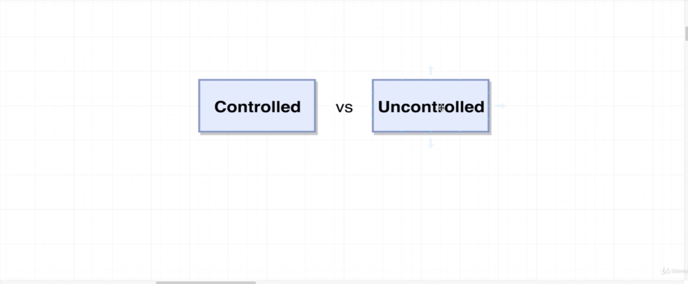
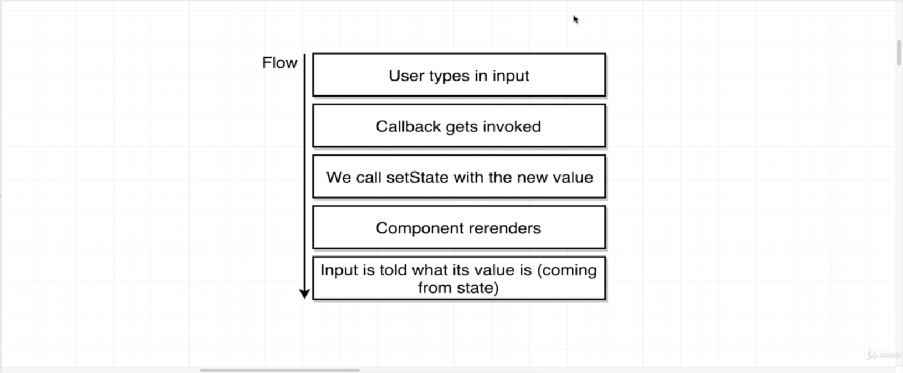
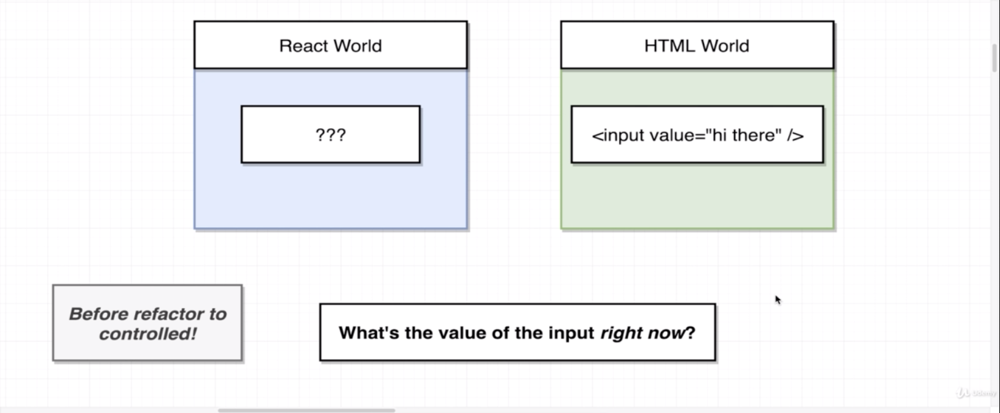

# Controlled Elements



## Controlled

- The moment a user types in an input `onChange={e => this.setState({ term: e.target.value })}` is called. from:

```javascript
render() {
  const { term } = this.state;
    return (
      <div className="ui segment">
        <form className="ui form">
          <div className="field">
            <label htmlFor="image-search" id="image-search">
            Image Search
            </label>
              <input
                id="image-search"
                type="text"
                placeholder="Search..."
                value={term}
                onChange={e => this.setState({ term: e.target.value })}
              />
          </div>
        </form>
    </div>
  );
}
```

- and our callback gets invoked
- Then inside that callback we pull the current value of the input or the whatever the user just typed in there out of the event object and we update our state on our component by calling set state.
- Inside the body the callback we take that event object which we are abbreviating as **e** and we pull the change into that input out of that event object by referencing `event.target.value`. Then we update the state on our component with that new value.
- So now `this.state.term` is going to contain whatever the user just typed into that input.
- Remember any time we call `this.setState()` the component is going to automatically render itself so the render method above gets called a second time the instant the user type something in the input.
- When the component renders, we take the value of that input, or we take our `this.state.term` and we assign it to the value prop `value={term}` of the input. The value prop `value={term}` is going to essentially overwrite whatever text is already inside of the input.
- So whatever we assign to that value prop is what the input is going to show.
- This entire series of changes or this entire flow right here is what constitutes a controlled element
- Before we were not going through those steps and we had a uncontrolled element.



## Uncontrolled



- The source of data inside of our application in our **uncontrolled** version was inside of our HTML document and it was not inside our component. That's the key part to understand. We should not store information inside of our HTML elements.
- In the case that we had before before we refactored it over to be controlled, the input tag itself was storing the value. It was the only thing inside of our entire application that knew what the value of the input was and we don't like to do that. Instead we want to centralize all of the information that we have inside of our React component.
- The key idea here is that we are storing our information inside of our components on our state property as opposed to storing information inside the DOM. We just want to make sure that it's the React application driving and storing all of our data and not the HTML.
